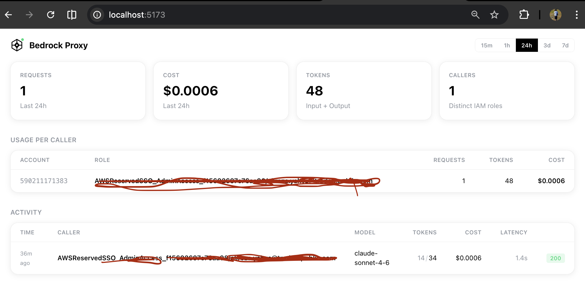

<p> <strong style="font-size: 2em">bedrockproxy</strong></p>

<br clear="left" />

A thin proxy in front of AWS Bedrock that tracks who's using what, how much it costs, and shows it all in a real-time dashboard.

**Problem**: AWS Bedrock has no per-IAM-role usage analytics. CloudWatch metrics only break down by model, not by caller. You can't answer "how much did team X spend on Claude this week?"

**Solution**: Point your AWS SDK at bedrockproxy instead of Bedrock. Same auth, same API. The proxy forwards everything to Bedrock and tracks usage per caller.



## How it works

```
Your app (AWS SDK)                    bedrockproxy                     AWS Bedrock
     │                                     │                               │
     │── POST /model/{id}/converse ──────▶│                               │
     │   (SigV4 signed, same as usual)     │── forward to Bedrock ───────▶│
     │                                     │   (re-signed with proxy creds)│
     │                                     │◀── response + token counts ──│
     │◀── response (unchanged) ───────────│                               │
     │                                     │── record: caller, model,      │
     │                                     │   tokens, cost, latency       │
     │                                     │── notify dashboard (websocket)│
```

## Usage

```bash
# Start the proxy
make dev

# Use it — just add --endpoint-url
aws bedrock-runtime converse \
    --endpoint-url http://localhost:8080 \
    --model-id eu.anthropic.claude-sonnet-4-6 \
    --messages '[{"role":"user","content":[{"text":"Hello"}]}]' \
    --region eu-central-1

# Or in Python
import boto3
client = boto3.client("bedrock-runtime", endpoint_url="http://localhost:8080")
```

No new API keys. No new auth. Just change the endpoint URL.

## Dashboard

Open `http://localhost:5173` to see:

- **Real-time usage** — requests, tokens, cost, updated live via WebSocket
- **Per-caller breakdown** — who's spending what, grouped by AWS account and IAM role
- **Activity log** — every request with caller, model, tokens, cost, latency
- **Time ranges** — 15m, 1h, 24h, 3d, 7d

## Architecture

```
                    ┌─────────────────────┐
                    │    bedrockproxy      │
                    │                     │
  AWS SDK ────────▶ │  Go HTTP server     │ ────────▶ AWS Bedrock
                    │  SigV4 parsing      │
                    │  In-memory store     │ ────────▶ S3 (periodic flush)
                    │  WebSocket events    │
                    │  Embedded React UI   │
                    └─────────────────────┘
                         single binary
```

- **In-memory store** for real-time dashboard (no database needed)
- **S3 flush** for long-term storage (gzipped JSONL, hourly partitioned)
- **Single binary** — Go backend with embedded React frontend (`go generate` + `go:embed`)
- **~16MB** compiled size

## Configuration

```yaml
server:
  port: 8080

aws:
  region: "eu-central-1"

s3:
  bucket: ""          # leave empty to disable S3 flushing
  prefix: "bedrockproxy"
  flush_interval: "5m"

models:
  - id: "anthropic.claude-sonnet-4-6"
    name: "Claude Sonnet 4.6"
    input_price_per_million: 3.0
    output_price_per_million: 15.0
    enabled: true
  - id: "anthropic.claude-haiku-4-5-20251001-v1:0"
    name: "Claude Haiku 4.5"
    input_price_per_million: 0.8
    output_price_per_million: 4.0
    enabled: true
```

## Development

```bash
# Backend (Go)
make dev

# Frontend (React + Vite, hot reload)
make dev-frontend

# Build single binary (generates frontend + embeds into Go binary)
make build
./bin/bedrockproxy

# Or step by step
go generate .   # build frontend → dist/
go build .      # embed dist/ → single binary
```

## Docker

```bash
# Run from ghcr.io
docker run -p 8080:8080 -v $(pwd)/config.yaml:/config.yaml \
  ghcr.io/alileza/bedrockproxy -config /config.yaml

# Build locally (amd64 + arm64)
docker build -t bedrockproxy .
```

## Caller identity

The proxy extracts the caller's access key from the SigV4 Authorization header and resolves the AWS account via `sts:GetAccessKeyInfo`.

For full IAM role ARN display (e.g. `assumed-role/MyRole/session`), register once per account:

```bash
ARN=$(aws sts get-caller-identity --query Arn --output text)
curl -X POST http://localhost:8080/api/register-caller \
  -H "Content-Type: application/json" \
  -H "Authorization: AWS4-HMAC-SHA256 Credential=$(aws configure get aws_access_key_id)/20260101/eu-central-1/bedrock/aws4_request, SignedHeaders=host, Signature=x" \
  -d "{\"arn\": \"$ARN\"}"
```

Rotated STS keys from the same account automatically inherit the registered ARN.
